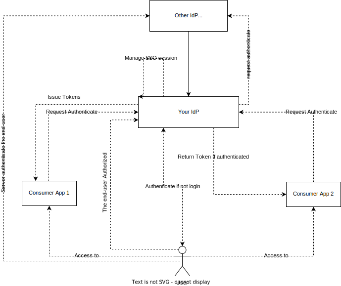

# Single Sign-On (SSO)

## What's SSO?
- Single Sign-on (SSO) occurs when a user logs in to one application and is then signed in to other applications automatically, regardless of the platform, technology, or domain the user is using.
- The user signs in only one time, hence the name of the feature (Single Sign-on).

## How it works with OpenID Connect?

With OIDC:
1. A user requests access to an application.
2. The application redirects the user to the identity provider for authentication.
3. The identity provider verifies the user, and if successful, prompts the user to grant data access to the application.
4. If access is granted, the identity provider generates an ID Token, which contains user identity information that the application can consume.
5. The identity provider returns the user to the application.

**Detail**

## References
- https://auth0.com/docs/authenticate/single-sign-on
- https://curity.io/resources/learn/web-client-sso-with-openid-connect/
